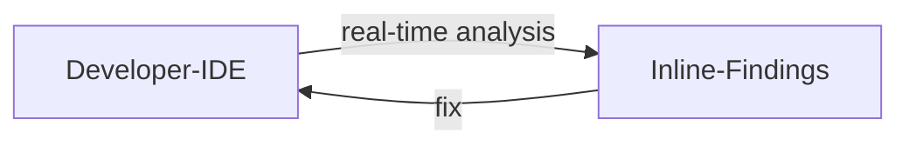
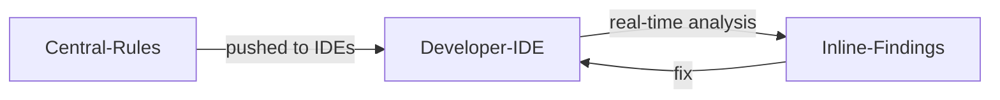
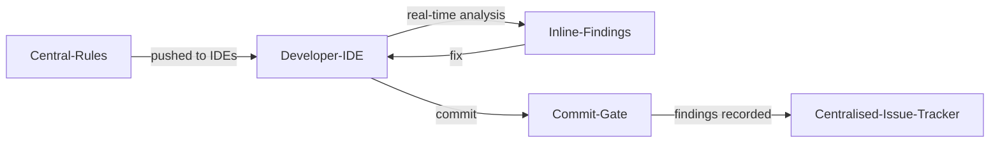

# Inline IDE Secure Code Analysis

| ID             |
| -------------- |
| DSOVS-CODE-007 |

## Summary

Inline IDE secure code analysis is the practice of scanning source code for potential security vulnerabilities and hardcoded secrets directly within the developer's integrated development environment (IDE), as the code is being written.

It is an important part of DevSecOps because it shifts security findings as far left as possible, to the earliest point in the software lifecycle. Rather than waiting for a pipeline scan or a code review to flag an issue, the developer receives real-time feedback in the editor, alongside the code they are actively working on.

By surfacing problems while the relevant code is still fresh in the developer's mind, inline analysis makes issues faster and cheaper to fix and reinforces secure coding habits over time. It complements, rather than replaces, the automated scanning performed later in the build pipeline, catching many issues before they are ever committed.

## Level 0 - No tool to assist developer with inline code analysis

At this level developers write code without any security feedback in their IDE. Vulnerabilities and hardcoded secrets are only discovered later, if at all, through pipeline scans, manual code review, or after deployment. The feedback loop is long, issues are expensive to remediate by the time they surface, and developers receive no in-context guidance to help them avoid insecure patterns in the first place.

## Level 1 - Verify the use of integrated development environment (IDE) plugin to perform inline secure code or hardcoded secrets analysis with locally defined rules

Developers install an IDE plugin or extension that performs secure code analysis and hardcoded secret detection as they type, highlighting findings inline. The rules are defined locally, configured by each developer or maintained within an individual project, so the analysis runs entirely on the developer's machine.

This is a significant improvement on Level 0 because feedback now arrives at the moment code is written, shortening the loop dramatically. However, because configuration is local and per-developer, rule sets drift between team members, coverage is inconsistent, and there is no guarantee that everyone is checking against the same standard.



## Level 2 - Verify implementation of centralised managed rules for integrated development environment (IDE) plugin

The IDE plugins are connected to a centrally managed configuration, so that every developer's editor enforces the same organisation-defined rule set. Rules, severities, and policies are maintained in one place (for example a shared server, configuration file, or policy repository) and distributed to all developers automatically.

This addresses the inconsistency of Level 1. Security standards are applied uniformly across the team regardless of individual setup, new or updated rules propagate to everyone without manual effort, and the organisation gains confidence that all developers are receiving the same, current security guidance in their IDE.



## Level 3 - Verify a mechanism to prevent insecure changes to be stored to source code repository

Level 3 builds on the centrally managed inline analysis of Level 2 by adding an enforcement gate that prevents insecure changes from reaching the source code repository. The same rules that provide inline feedback are enforced at commit or push time, typically through pre-commit hooks, server-side hooks, or branch protection that blocks code containing unresolved security findings or hardcoded secrets.

This ensures that inline analysis is not merely advisory: insecure code cannot be silently committed even if a developer ignores the in-editor warnings. The effectiveness of the rules and the gate is monitored and periodically reviewed, with findings tracked and rule sets continuously improved, giving the organisation a measured, consistently enforced control at the earliest point in the lifecycle.



# Notable Tools

⚠️ **Disclaimer**

Apart from official OWASP Projects, the tools in this section have been chosen on the basis of their proven capabilities alone and there is no other relationship between the DSOVS project leaders and the creators or vendors who maintain them. 

If you have a suggestion for a notable tool please [💡 Suggest a Tool](https://github.com/OWASP/www-project-devsecops-verification-standard/discussions/categories/ideas) 

## [SonarLint](https://github.com/SonarSource/sonarlint-core)

SonarLint is a free IDE extension from SonarSource that provides real-time code quality and security analysis as you type, with support for IDEs such as VS Code, IntelliJ IDEA, Visual Studio, and Eclipse. Issues are highlighted inline with explanations and remediation guidance. In Connected Mode, SonarLint binds to a SonarQube or SonarCloud server so that the rule set and quality profile are managed centrally and shared consistently across the whole team, supporting the centrally managed rules expected at Level 2.

## [Semgrep](https://github.com/semgrep/semgrep)

Semgrep is an open-source static analysis tool that uses lightweight, language-aware pattern rules to detect security issues. Its IDE extensions (for example for VS Code and IntelliJ) run rules as developers work and surface findings inline. Rules can be authored locally for a project or pulled from a centrally managed registry, so the same policy can be shared across developers and reused later in CI for end-to-end consistency.

A typical project-level configuration pins the rule sets the IDE extension and CI should use:

```yaml
# .semgrep.yml
rules:
  - p/security-audit
  - p/secrets
  - p/owasp-top-ten
```

## [Snyk](https://github.com/snyk/snyk)

Snyk offers IDE plugins (for VS Code, the JetBrains IDEs, Visual Studio, and Eclipse) that bring its security analysis directly into the editor, covering code-level vulnerabilities (Snyk Code), open-source dependency issues, and secrets. Findings appear inline with severity and fix guidance, and when authenticated against a Snyk organisation the applicable rules and policies are governed centrally, keeping IDE feedback aligned with the organisation's standards and with scans performed later in the pipeline.
