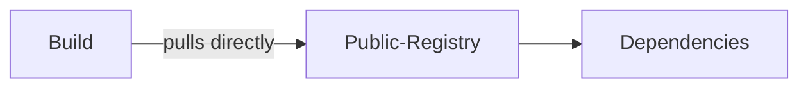
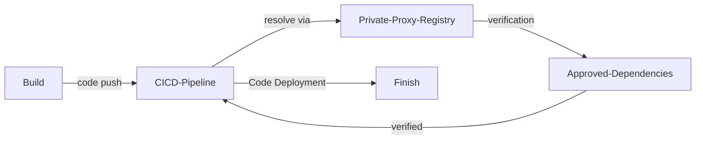
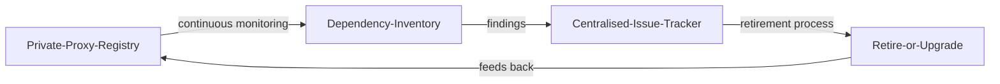

# Secure Dependency Management

| ID             |
| -------------- |
| DSOVS-CODE-009 |

## Summary

Secure Dependency Management is the process of identifying, managing, and tracking all software dependencies when building, deploying, and managing applications. 

It is an important part of DevSecOps because it helps to ensure that all applications built using open source and commercial dependencies are secure and up-to-date. 

By properly managing dependencies, organizations can help mitigate risk from known vulnerabilities in their application stack and keep critical applications updated with the latest security patches.

## Level 0 - Direct use of public repositories for third-party dependencies and libraries

At this level of maturity there is no controlled approach to sourcing third-party code. Developers pull dependencies directly from public registries such as npm, PyPI, Maven Central, NuGet, or RubyGems, typically by adding a package name to a manifest or running an install command on a workstation or build agent.

Because there is no intermediary between the application and these public sources, the organisation has little visibility into what is being consumed and limited protection against availability outages, package tampering, typosquatting, or dependency confusion attacks. Any package that resolves at build time is trusted implicitly, and a registry change can break or compromise a build without warning.

## Level 1 - Verity implementation of a private repository to manage third-party dependencies and libraries

At this stage the organisation introduces a private repository or proxy that sits between developers and the public registries. Tools such as JFrog Artifactory, Sonatype Nexus, or GitHub Packages cache and serve third-party dependencies, so all package requests are routed through a managed, organisation-controlled layer rather than reaching public sources directly.

This provides a consistent source of truth for builds, protects against upstream availability problems by caching artefacts locally, and gives the organisation a single point at which dependency traffic can later be observed and governed. Build agents and developer environments are configured to resolve packages only through this private repository.



## Level 2 - Verify that only verified third-party dependencies and libraries can be used by the application

Here the private repository is used not just as a cache but as a gate. Only dependencies that have been vetted and approved may be consumed, enforced through allow-lists, curated repositories, or policy rules that block packages failing defined criteria such as known vulnerabilities, restrictive licences, or low reputation.

Verification is strengthened by validating the integrity and origin of artefacts, for example by checking package signatures or provenance attestations, so that consumers can be confident a dependency genuinely originates from its expected publisher. Automated update tooling such as Dependabot or Renovate is introduced to keep approved dependencies current, raising pull requests for new versions so that updates are reviewed and applied in a controlled, repeatable way rather than ad hoc.



## Level 3 - Verify implementation to monitor application uses of third-party dependencies and libraries with process to retire unused or vulnerable dependencies

At the highest level of maturity, dependency usage is continuously monitored across the application portfolio. A maintained software bill of materials (SBOM) and ongoing composition analysis give the organisation an accurate, centralised picture of which dependencies each application consumes and how those dependencies map to newly disclosed vulnerabilities.

This visibility feeds a defined process for retiring dependencies that are no longer needed or that have become vulnerable. Unused packages are removed, vulnerable components are upgraded or replaced according to agreed service levels, and the effectiveness of the overall process is measured and periodically reviewed. Automated update tooling, policy enforcement, and monitoring work together so that the dependency estate is kept lean, current, and continuously improved.



# Notable Tools

⚠️ **Disclaimer**

Apart from official OWASP Projects, the tools in this section have been chosen on the basis of their proven capabilities alone and there is no other relationship between the DSOVS project leaders and the creators or vendors who maintain them. 

If you have a suggestion for a notable tool please [💡 Suggest a Tool](https://github.com/OWASP/www-project-devsecops-verification-standard/discussions/categories/ideas) 

## [Renovate](https://github.com/renovatebot/renovate)

Renovate is an automated dependency update tool that scans repositories across many ecosystems, detects outdated or vulnerable dependencies, and raises pull requests to update them. It is highly configurable through a `renovate.json` file, supporting grouping, scheduling, automerge, and vulnerability-driven updates, which makes it well suited to keeping approved dependencies current at scale.

A minimal `renovate.json` configuration committed to the root of a repository:

```
{
  "$schema": "https://docs.renovatebot.com/renovate-schema.json",
  "extends": [
    "config:recommended"
  ],
  "schedule": [
    "before 6am on monday"
  ],
  "vulnerabilityAlerts": {
    "enabled": true
  },
  "packageRules": [
    {
      "matchUpdateTypes": ["minor", "patch"],
      "automerge": true
    }
  ]
}
```

<a href="https://github.com/renovatebot/github-action"> GitHub Actions

```
name: Renovate
on:
  schedule:
    - cron: "0 4 * * *" # run once a day at 4 AM
  workflow_dispatch:
jobs:
  renovate:
    runs-on: ubuntu-latest
    steps:
      - uses: actions/checkout@v4
      - name: Self-hosted Renovate
        uses: renovatebot/github-action@v40
        with:
          token: ${{ secrets.RENOVATE_TOKEN }}
```

## [Dependabot](https://github.com/dependabot)

Dependabot is GitHub's native dependency update tool. It monitors a repository's manifests for outdated or vulnerable dependencies and automatically opens pull requests with the necessary updates. It is enabled by committing a `dependabot.yml` file under `.github/`, where update schedules and ecosystems are declared per package manager.

A `.github/dependabot.yml` configuration enabling version and security updates:

```
version: 2
updates:
  - package-ecosystem: "npm"
    directory: "/"
    schedule:
      interval: "weekly"
    open-pull-requests-limit: 10
  - package-ecosystem: "github-actions"
    directory: "/"
    schedule:
      interval: "weekly"
```