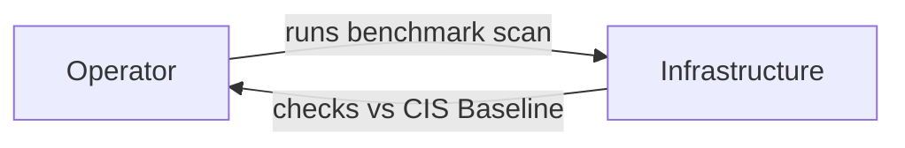
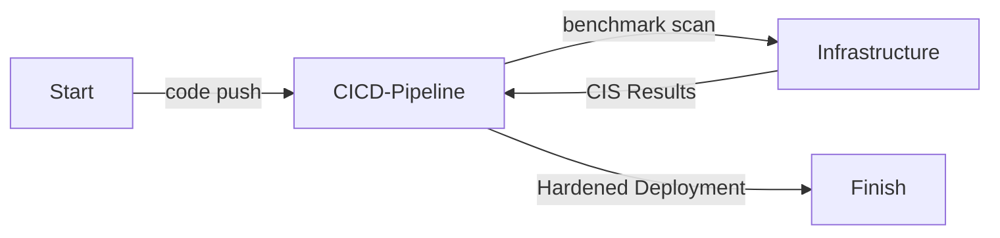
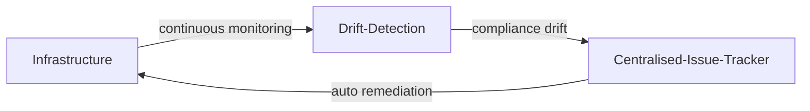

# Environment Hardening

| ID            |
| ------------- |
| DSOVS-OPR-001 |

## Summary

Environment hardening is the process of securing a system or environment by reducing its attack surface. This is done by removing unnecessary components, services, ports and protocols, disabling insecure defaults, and applying security patches to the operating systems, container images and orchestration platforms that host an application.

It is an important part of DevSecOps because it mitigates potential vulnerabilities in the underlying infrastructure rather than the application code alone. Rather than relying on intuition, mature teams measure their infrastructure against an agreed baseline, most commonly the CIS Benchmarks, which provide consensus-driven configuration guidance for servers, containers and Kubernetes clusters.

By hardening the environment against such a baseline, organisations protect against data breaches, reduce the blast radius of a compromise, and demonstrate a defensible, repeatable security posture across every host they operate.

## Level 0 - No environment vulnerability scanning tool

At this level there is no tooling or process in place to assess the security configuration of the environment. Servers, container images and clusters run with their out-of-the-box defaults, which typically prioritise ease of setup over security and leave unnecessary services, open ports and permissive permissions enabled.

Because nothing is measured against a recognised baseline, the team has no visibility into how exposed its infrastructure is, and misconfigurations accumulate silently until they are discovered by an attacker or an incident.

## Level 1 - Verify use of tool to perform on-demand scan to identify environment vulnerabilities in production environment

At this stage a hardening or configuration-assessment tool is available and is run manually, on demand, against a defined baseline such as a CIS Benchmark. An engineer might run a scan against a server or a container image before it goes live, review the failed checks, and remediate the most important findings by hand.

This represents a meaningful improvement, because the environment is now being compared against an objective standard. However, scanning is ad hoc and depends on someone remembering to run it. Results are rarely recorded or tracked over time, so configuration drift between scans goes unnoticed and coverage across the estate is inconsistent.



## Level 2 - Verify that the vulnerability scanning tool is scheduled to perform automated scans and report status to system owner through a centralised issue tracking system

Here, hardening checks are integrated into the build and deployment pipeline so that they run automatically and consistently. Container images are scanned against a benchmark as they are built, infrastructure-as-code and host configurations are evaluated before promotion, and a build can be failed when a host or image falls below the required hardening threshold.

Because the checks are automated and gated, every artifact is verified against the same baseline before it reaches production, removing reliance on individual engineers. Findings are surfaced back to the system owner and routed into a tracking system, giving teams a consistent, auditable record of the environment's compliance status.



## Level 3 - Verify implementation to apply automatic remediation at the time of vulnerability identified

At the highest level of maturity, hardening becomes a continuous process rather than a point-in-time check. Running hosts, images and clusters are monitored continuously for configuration drift away from the approved baseline, and deviations are detected as soon as they occur rather than at the next manual review.

Findings from every source are consolidated into a centralised system, where they are correlated, prioritised and trended over time. Where it is safe to do so, remediation is applied automatically the moment a deviation is identified, for example by reapplying a hardening profile or rebuilding a non-compliant node from a known-good image. The effectiveness of the hardening programme itself is reviewed periodically so that baselines, exceptions and automated controls are refined as the threat landscape and the estate evolve.



# Notable Tools

⚠️ **Disclaimer**

Apart from official OWASP Projects, the tools in this section have been chosen on the basis of their proven capabilities alone and there is no other relationship between the DSOVS project leaders and the creators or vendors who maintain them. 

If you have a suggestion for a notable tool please [💡 Suggest a Tool](https://github.com/OWASP/www-project-devsecops-verification-standard/discussions/categories/ideas) 

## [OpenSCAP](https://github.com/OpenSCAP/openscap)

OpenSCAP is an open source implementation of the Security Content Automation Protocol (SCAP). It evaluates a system against machine-readable security policies, including profiles aligned to the CIS Benchmarks and other standards such as STIG and PCI-DSS, and can both report on and remediate non-compliant settings. It is well suited to scanning operating systems and container images as part of an automated pipeline.

<a href="https://github.com/OpenSCAP/openscap"> GitHub Actions

```yaml
name: openscap-hardening
on:
  push:
  pull_request:
  workflow_dispatch:
  schedule:
    - cron: "0 4 * * *" # run once a day at 4 AM
jobs:
  oscap-scan:
    runs-on: ubuntu-latest
    steps:
      - uses: actions/checkout@v4
      - name: Install OpenSCAP and SCAP Security Guide
        run: sudo apt-get update && sudo apt-get install -y libopenscap8 ssg-base ssg-debderived
      - name: Evaluate host against the CIS profile
        run: |
          oscap xccdf eval \
            --profile xccdf_org.ssgproject.content_profile_cis_level1_server \
            --results results.xml \
            --report report.html \
            /usr/share/xml/scap/ssg/content/ssg-ubuntu2204-ds.xml || true
      - name: Upload OpenSCAP report
        uses: actions/upload-artifact@v4
        with:
          name: openscap-report
          path: report.html
```

## [Lynis](https://github.com/CISOfy/lynis)

Lynis is a battle-tested security auditing tool for Unix-based systems. It performs an in-depth scan of a running host, checking configuration, installed software, and hardening of services against best practice, and produces a hardening index alongside actionable suggestions. It is lightweight, agentless and ideal for on-demand audits as well as scheduled scans of production servers.

<a href="https://github.com/CISOfy/lynis"> GitHub Actions

```yaml
name: lynis-audit
on:
  workflow_dispatch:
  schedule:
    - cron: "0 3 * * 1" # run weekly on Monday at 3 AM
jobs:
  lynis:
    runs-on: ubuntu-latest
    steps:
      - uses: actions/checkout@v4
      - name: Install Lynis
        run: sudo apt-get update && sudo apt-get install -y lynis
      - name: Run system audit
        run: sudo lynis audit system --no-colors --report-file lynis-report.dat || true
      - name: Upload Lynis report
        uses: actions/upload-artifact@v4
        with:
          name: lynis-report
          path: lynis-report.dat
```

## [kube-bench](https://github.com/aquasecurity/kube-bench)

kube-bench checks whether a Kubernetes cluster is deployed securely by running the checks documented in the CIS Kubernetes Benchmark. It inspects control plane components, worker nodes and policies, reporting each control as pass, fail or warn, and can output results in JSON for ingestion into a centralised tracker. It is the de facto tool for verifying that clusters meet the CIS baseline.

<a href="https://github.com/aquasecurity/kube-bench"> GitHub Actions

```yaml
name: kube-bench
on:
  workflow_dispatch:
  schedule:
    - cron: "0 5 * * *" # run once a day at 5 AM
jobs:
  kube-bench:
    runs-on: ubuntu-latest
    steps:
      - uses: actions/checkout@v4
      - name: Run kube-bench against the CIS Kubernetes Benchmark
        run: |
          docker run --rm \
            -v $(pwd):/out \
            aquasec/kube-bench:latest \
            run --json | tee /out/kube-bench-results.json || true
      - name: Upload kube-bench results
        uses: actions/upload-artifact@v4
        with:
          name: kube-bench-results
          path: kube-bench-results.json
```
