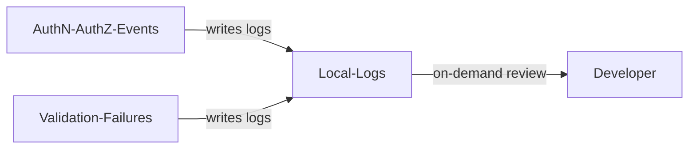
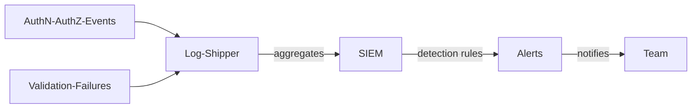
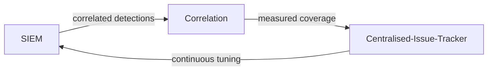

# Application Security Logging

| ID            |
| ------------- |
| DSOVS-OPR-004 |

## Summary

Application Security Logging is a process of collecting, analyzing and managing log data related to application security events. 

It helps to detect security breaches, identify unauthorized access attempts, or monitor the performance and effectiveness of application security controls.

It is an important element of DevSecOps because it provides visibility into the security posture of applications. 

This makes it easier to spot potential threats and respond swiftly in order to minimize damage. 

Additionally, application security logging can also be used to detect and investigate suspicious behavior and quickly take corrective action to mitigate risk.

## Level 0 - No centralised logging for security events

At this level applications emit little in the way of security-relevant logging, and what they do produce is inconsistent and local to each service. Events that matter for security, such as authentication attempts, authorisation decisions, input validation failures and significant state changes, are either not recorded at all or buried in generic debug output that nobody collects.

Without deliberate, structured security logging there is no dependable trail to show who did what within the application. When an account is compromised or a flaw is exploited, the team has no way to reconstruct the sequence of events, and the absence of any guidance also means developers risk the opposite failure mode of logging passwords, tokens or personal data in plain text.

## Level 1 - Verify that application security events are logged and monitored in a centralised location

At level one the application deliberately logs security-relevant events. Following guidance such as the OWASP Logging Cheat Sheet and ASVS V7, the team identifies the events worth recording, including successful and failed logins, access-control failures, input validation and output encoding failures, session lifecycle changes, and use of higher-risk functionality, and emits them in a consistent, structured format with enough context to be useful.

Equal care is taken over what must never appear in logs: credentials, session tokens, API keys and sensitive personal data are excluded or masked at the point of logging. At this level review is still mostly manual and on demand, with developers or responders querying the logs when investigating a specific issue rather than monitoring them continuously, but the events being captured are meaningful and safe to retain.

## Level 2 - Verify implementation of alert and notification to development team for abuse and anomalies

At level two application security logs are forwarded to a central platform where events from every service are aggregated, normalised and stored together, typically a SIEM or log analytics stack. This consolidated view lets the team reason about behaviour across the whole application rather than one instance at a time, and to spot patterns such as credential-stuffing, repeated authorisation failures, or a spike in input validation rejections that would be invisible in isolated logs.

Detection rules built on this data are connected to alerting, so that abuse and anomalies automatically notify the responsible development team in near real time. The move from passively storing application events to actively alerting on suspicious patterns is the defining step at this level, turning the log stream into an early-warning system rather than a forensic archive consulted only after the fact.

## Level 3 - Verify that development team have ability to monitor and analyse application security events

At level three application security logging is a measured and continuously refined discipline. Detections are correlated across events and with environment telemetry so that a meaningful attack narrative, for example a series of failed authorisations followed by a successful privilege change and an unusual data export, is recognised as a single incident. Coverage is tracked against the application's features and trust boundaries, so the team can show which security events are instrumented and can prioritise closing the gaps.

Underpinning this are retention and integrity controls: logs are kept for a defined period and protected against tampering so they remain trustworthy evidence, while continuing to exclude secrets and sensitive personal data. The team also tunes detection content on an ongoing basis, reducing noisy or low-value alerts and adding coverage for new abuse cases as the application evolves, giving developers genuine, analyst-ready insight into how their application is being used and attacked.

# Notable Tools

⚠️ **Disclaimer**

Apart from official OWASP Projects, the tools in this section have been chosen on the basis of their proven capabilities alone and there is no other relationship between the DSOVS project leaders and the creators or vendors who maintain them. 

If you have a suggestion for a notable tool please [💡 Suggest a Tool](https://github.com/OWASP/www-project-devsecops-verification-standard/discussions/categories/ideas) 

## [OWASP Security Logging](https://github.com/javabeanz/owasp-security-logging)

The OWASP Security Logging project provides logging libraries (with bindings for Logback and Log4j2) that make it easier to emit consistent, security-relevant events from application code. It adds helpers for marking security events, masking sensitive values and enriching log entries with contextual metadata, which supports the structured, secret-free logging that the levels above require.

Structured-logging libraries more generally (for example logback/log4j2 with JSON encoders in the JVM ecosystem, structlog in Python, or Serilog in .NET) are also worth adopting, because emitting events as structured, parseable records is what allows a central platform to search, correlate and alert on them reliably.

## Further reading

- [OWASP Logging Cheat Sheet](https://cheatsheetseries.owasp.org/cheatsheets/Logging_Cheat_Sheet.html)
- [OWASP Application Security Verification Standard (ASVS) - V7 Logging and Error Handling](https://owasp.org/www-project-application-security-verification-standard/)
- [OWASP Logging Vocabulary Cheat Sheet](https://cheatsheetseries.owasp.org/cheatsheets/Logging_Vocabulary_Cheat_Sheet.html)
- [OWASP Top 10 - A09:2021 Security Logging and Monitoring Failures](https://owasp.org/Top10/A09_2021-Security_Logging_and_Monitoring_Failures/)

## References

- [OWASP SAMM - Operational Management](https://owaspsamm.org/model/operations/operational-management/)