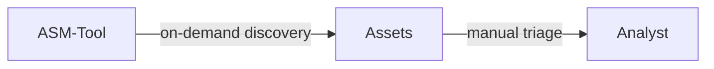
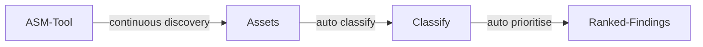
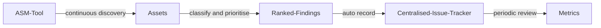

# Attack Surface Management

| ID            |
| ------------- |
| DSOVS-OPR-007 |

## Summary

Attack surface management (ASM) solutions and tools are used to identify, track, and manage the vulnerabilities present in an organization's digital infrastructure, including software, hardware, and networks.

The goal of ASM is to reduce the organization's overall attack surface, which is the sum of all the points in its digital infrastructure that could potentially be exploited by cybercriminals. By reducing the attack surface, organizations can better protect themselves from cyber attacks and reduce their risk of a successful breach.

ASM solutions and tools typically provide a comprehensive view of an organization's digital assets, including those that are hidden or forgotten. They also identify vulnerabilities and misconfigurations in software, systems, and networks, which can be used by attackers to gain unauthorized access or cause damage.

Some of the benefits of ASM solutions and tools for cybersecurity in organizations include:

1. Improved visibility: ASM solutions provide a comprehensive view of an organization's digital assets, which allows for better visibility and understanding of the security risks and vulnerabilities present in the system.

2. Proactive approach: ASM solutions enable organizations to take a proactive approach to security by identifying and addressing vulnerabilities before they are exploited by cybercriminals.

3. Enhanced threat intelligence: ASM tools can provide valuable threat intelligence by tracking the latest threats and vulnerabilities, allowing organizations to prioritize and address the most critical risks.

4. Compliance: ASM solutions can help organizations comply with various regulatory requirements and standards, such as the General Data Protection Regulation (GDPR) and the Payment Card Industry Data Security Standard (PCI DSS).

5. Cost savings: ASM solutions can help organizations reduce the costs associated with data breaches and cyber attacks by addressing vulnerabilities and reducing the likelihood of a successful attack.

Overall, ASM solutions and tools are essential for maintaining strong cybersecurity posture in organizations, providing better visibility, proactive approach, enhanced threat intelligence, compliance, and cost savings.

## Level 0 - No tool to perform real-time discovery, classify, assess and monitor the security organisation's IT assets

At this level there is no tooling to discover, classify, assess or monitor the organisation's internet-facing assets. Whatever inventory exists is manual and quickly goes stale, captured in spreadsheets or tribal knowledge rather than derived from what is actually exposed.

As a result the organisation has no reliable picture of its true attack surface. Forgotten subdomains, shadow IT, abandoned cloud instances and newly exposed services accumulate unseen, and any one of them can become an entry point that defenders are unaware of. Without continuous visibility, exposures are typically only discovered after an incident or an external report.

## Level 1 - Verify use of tool to perform continous discovery, classify, assess and monitor the security of organisation's IT assets

At Level 1 a dedicated tool is introduced to discover and enumerate the organisation's external assets, replacing manual record-keeping with active reconnaissance. Subdomains, hosts, open ports and exposed services are identified by the tool, giving a far more accurate and current view of what is reachable from the internet than any hand-maintained list.

The tool is run regularly and can be scheduled to refresh the inventory on an ongoing basis, so newly stood-up or decommissioned assets are reflected over time. The emphasis here is on visibility and coverage: the organisation now knows what it has exposed and can assess and monitor those assets, even if triage of the results still relies largely on human judgement.



## Level 2 - Verify that discovered organisation's IT assets are properly classified and any identified possible attack vectors are automatically prioritised

Level 2 builds on continuous discovery by adding automated classification and prioritisation. Discovered assets are enriched and categorised, for example by technology, ownership or business criticality, and the tooling automatically probes them for misconfigurations, exposed services and known vulnerabilities, turning a raw inventory into an actionable view of attack vectors.

Rather than presenting every finding with equal weight, the pipeline ranks possible attack vectors so that the most serious exposures rise to the top. This continuous, automated flow means new assets are assessed as soon as they appear and the highest-risk issues are surfaced for attention first, a clear advance over Level 1 where discovery existed but interpretation and prioritisation were manual.



## Level 3 - Verify that the findings are automatically recorded to a centralised issue tracker system and periodically review tool's effectiveness

At Level 3 the attack surface management process is the same continuous, automated and prioritised pipeline as Level 2, with the addition that findings are automatically recorded into a centralised issue tracking system. Each exposure becomes a tracked item that can be assigned, remediated and verified alongside other security work, ensuring nothing discovered is quietly lost.

Because findings are centralised, the programme can be measured: metrics such as time to remediate, recurrence of exposures and coverage of the known estate become visible and reportable. The effectiveness of the tooling and process is reviewed periodically, with detection rules, scoping and prioritisation tuned in response to what the data shows. This closes the loop from discovery through remediation to continuous improvement.



# Notable Tools 

⚠️ **Disclaimer**

Apart from official OWASP Projects, the tools in this section have been chosen on the basis of their proven capabilities alone and there is no other relationship between the DSOVS project leaders and the creators or vendors who maintain them. 

If you have a suggestion for a notable tool please [💡 Suggest a Tool](https://github.com/OWASP/www-project-devsecops-verification-standard/discussions/categories/ideas) 

## [OWASP Amass](https://github.com/owasp-amass/amass)

The OWASP Amass project performs in-depth attack surface mapping and external asset discovery. It combines passive sources, DNS enumeration and active reconnaissance to discover subdomains, hosts and related infrastructure, making it well suited to continuously building and refreshing an inventory of what an organisation exposes on the internet.

Running Amass on a schedule lets you track how the external footprint of a domain changes over time and feed the results into downstream assessment.

```bash
# Enumerate subdomains and associated assets for a target domain
amass enum -d example.com -o amass-example.txt

# Compare results between runs to detect newly exposed assets
amass enum -d example.com -json results.jsonl
```

## [Nuclei](https://github.com/projectdiscovery/nuclei)

Nuclei is a fast, template-driven scanner that checks targets for misconfigurations, exposed services and known vulnerabilities using a large, community-maintained template library. Pointed at the assets discovered during attack surface mapping, it automates the assessment and prioritisation step by reporting findings with severity, making it a natural fit for continuous external monitoring.

The workflow below runs Nuclei on a schedule so that the known attack surface is re-checked regularly and new exposures are surfaced automatically.

<a href="https://github.com/projectdiscovery/nuclei-action"> GitHub Actions

```yaml
name: nuclei-scan
on:
  workflow_dispatch:
  schedule:
    - cron: "0 4 * * *" # run once a day at 4 AM
jobs:
  scan:
    name: nuclei
    runs-on: ubuntu-latest
    steps:
      - uses: actions/checkout@v4
      - name: Run Nuclei
        uses: projectdiscovery/nuclei-action@main
        with:
          target: https://example.com
          flags: "-severity critical,high,medium"
```

## References
