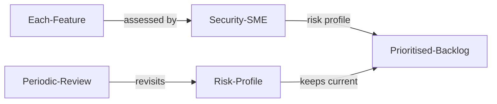

# Risk Assessment

| ID            |
| ------------- |
| DSOVS-ORG-001 |

## Summary

Risk assessment is a process of analyzing the risks associated with an organization, project, system or business process that could have an impact on its success. 

It is an important part of DevSecOps because it helps identify any potential vulnerabilities or threats that may affect the security and performance of the system or process. 

Risk assessment enables organizations to develop better security practices, prioritize remediation efforts, and proactively address potential risks before they become problems.

## Level 0 - No risk assessment activities performed

There is no evidence that the organisation performs any form of risk assessment across its projects, systems, or business processes. Potential vulnerabilities and threats are neither identified nor analysed, so decisions about features and architecture are made without any structured understanding of the security risks they introduce. As a result, the organisation cannot prioritise remediation effort or anticipate problems before they materialise.

## Level 1 - Verify that risk assessment exercise is performed on request

Risk assessment is carried out only on an ad-hoc basis, typically in response to a specific request, a notable incident, or a particular concern raised by a stakeholder. While these exercises can surface useful insights, they are reactive and inconsistent, and there is no guarantee that every feature or change receives the same scrutiny. Because the activity depends on someone asking for it, significant risks can go unexamined whenever a request is not made.

## Level 2 - Verify that security subject matter expert within software development team performs risk assessment on each feature

A security subject matter expert embedded within the software development team assesses the risk of each feature as it is designed and built. This brings security analysis directly into the development workflow, allowing threats and vulnerabilities to be considered consistently for every change rather than only when prompted. The expert's involvement helps the team weigh design decisions against their security implications early, so that remediation can be prioritised before features are released.

## Level 3 - Verify that periodic review schedule is defined for the development team to review the risk profile.

In addition to assessing individual features, the development team follows a defined, periodic schedule to review the overall risk profile and keep it current as the system, its dependencies, and the threat landscape evolve. Each review revisits previously accepted risks and confirms whether earlier decisions remain valid. Risk decisions are recorded and tracked over time, giving the organisation a clear, auditable view of how its risk posture is changing and where attention is needed next.

## Further reading

### Risk assessment tools
- https://evaluator.tidyrisk.org/

### Risk assessment resources
- **NIST - Secure Software Development Framework  (SSDF)**
The Secure Software Development Framework (SSDF) is a set of fundamental, sound, and secure software development practices based on established secure software development practice documents from organizations such as  [BSA](https://www.bsa.org/),  [OWASP](https://owasp.org/), and  [SAFECode](https://safecode.org/). Few software development life cycle (SDLC) models explicitly address software security in detail, so practices like those in the SSDF need to be added to and integrated with each SDLC implementation.
	- https://csrc.nist.gov/Projects/ssdf

- **Synopsys**
A practitioner-oriented overview of software risk analysis that explains how to identify, assess, and prioritise security risks throughout the software development life cycle.
	-	https://www.synopsys.com/blogs/software-security/software-risk-analysis/

- **OWASP Risk Rating Methodology**
A structured approach for estimating the severity of security risks by scoring the likelihood and impact of each issue, helping teams rank and prioritise remediation consistently.
	- https://owasp.org/www-community/OWASP_Risk_Rating_Methodology