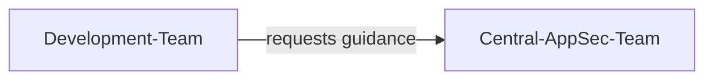
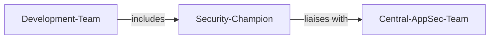
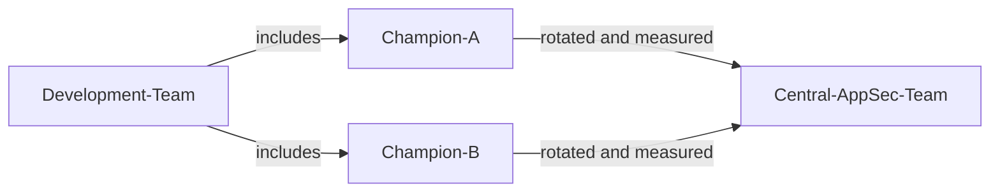

# Security Champion

| ID            |
| ------------- |
| DSOVS-ORG-003 |

## Summary

A security champion is a person or team whose role within an organization is to promote and implement security practices. 

They are responsible for ensuring that security is considered throughout the development and deployment process of products, services and applications. 

Security champions play an important role in DevSecOps as they work to ensure that security is integrated into DevOps processes and tools, helping organizations achieve their security goals. 

They also serve as a bridge between security and DevOps teams, communicating the importance of security and advocating for its inclusion. 

Security champions help ensure that an organization’s DevSecOps initiatives are effective, driving real results.

## Level 0 - No application security capability in the organisation

The organisation has no recognised application security capability and no individuals tasked with advocating for secure development practices. Security knowledge is not consciously cultivated within the engineering teams, and there is no point of contact who can answer security questions or guide design and implementation decisions. As a result, security considerations depend entirely on the incidental experience of individual developers rather than any deliberate organisational function.

## Level 1 - Verify that the centralised application security function or capability exists to provide subject matter expertise

A central application security function or team has been established to provide subject matter expertise to the wider organisation. Development teams can reach out to this group for guidance on threats, secure design, and remediation, which gives the organisation a consistent and authoritative source of security knowledge. While this represents a meaningful improvement over having no capability at all, the expertise remains concentrated in a single team and is delivered on request, so coverage across individual development teams is uneven and reactive rather than embedded in day-to-day delivery.

## Level 2 - Verify that a dedicated security champion appointed to work within each development team

The organisation has moved security expertise closer to where software is built by appointing a dedicated security champion within each development team. These champions are embedded developers who advocate for security inside their own teams, act as the first point of contact for security questions, and create a direct link back to the central application security function. Because every team now has a named individual responsible for promoting secure practices, security guidance is applied more consistently and earlier in the lifecycle, and issues are increasingly identified by the teams themselves rather than only during centralised review.

## Level 3 - Verify that the multiple security subject matter experts can be the champion within the development team

Security expertise has matured to the point where multiple subject matter experts within a team are capable of acting as the security champion, removing reliance on any single person. The champion role is supported, rotated, and measured, with the organisation actively developing the depth of its security talent and tracking the effectiveness of the programme. This redundancy and ongoing investment make the security champion capability resilient and continuously improving, allowing the organisation to scale secure development practices as teams grow and to refine the programme in line with its evolving risk profile.

## Further reading
- [OWASP Security Culture Project](https://owasp.org/www-project-security-culture/) - Guidance on building a security culture, including how to establish and run a security champions programme.
- [OWASP Security Champions Playbook](https://github.com/c0rdis/security-champions-playbook) - A practical, step-by-step playbook for identifying, nominating, and supporting security champions within development teams.
- [OWASP SAMM - Education & Guidance](https://owaspsamm.org/model/governance/education-and-guidance/) - The SAMM governance practice covering how organisations grow security knowledge and embedded expertise such as champions.