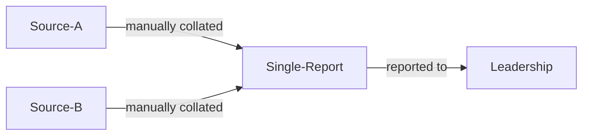
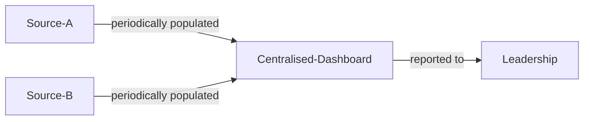
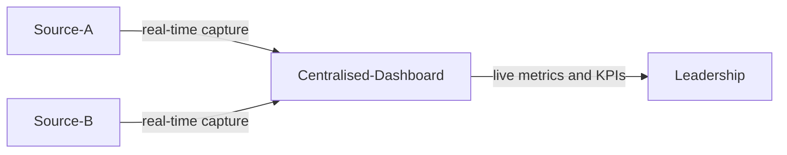

# Security Reporting

| ID            |
| ------------- |
| DSOVS-ORG-004 |

## Summary

Security reporting is the ongoing process of collecting and analyzing data regarding security-related activities within an organization. 

It's an important part of DevSecOps because it provides organizations with key insights into their security posture, enables decision makers to more accurately identify and assess existing and potential threats, and helps organizations respond to cybersecurity incidents quickly and appropriately. 

Security reporting also helps organizations develop better security policies, practices and procedures, as well as ensure compliance with data protection and other legal and regulatory requirements.

## Level 0 - Security findings is segregated in many systems and tools

Security findings are scattered across numerous disconnected systems and tools, with each scanner, tracker, or assessment maintaining its own isolated view. There is no consolidated reporting, so leadership has no coherent picture of the organisation's security posture and cannot reliably understand where risk concentrates. Because the data is fragmented and never brought together, trends go unnoticed, duplicate issues are common, and decisions about prioritisation and investment are made without an accurate evidence base.

## Level 1 - Verify that security findings from multiple sources are manually collated to a single report

Findings from the various sources are manually gathered and combined into a single report, giving the organisation its first unified view of security issues. This collation is typically performed periodically by individuals who export, deduplicate, and summarise results by hand, which makes it possible to communicate an overall position to stakeholders. The process is labour-intensive and prone to inconsistency and delay, so while it is a clear improvement over completely siloed data, the report quickly becomes stale and its accuracy depends heavily on the diligence of whoever assembles it.

## Level 2 - Verify that security findings from multiple sources are periodically populated to a centralised dashboard

Findings from multiple sources are now fed into a centralised dashboard on a regular, repeatable basis, replacing manual report assembly with a defined and consistent process. Leadership and delivery teams can view a common, up-to-date representation of findings, severities, and ownership, which supports more reliable prioritisation and clearer accountability. Because the dashboard is populated on a schedule rather than continuously, the information still lags behind reality between refresh cycles, but the consistency and shared visibility represent a substantial step beyond hand-built reports.

## Level 3 - Verify that the centralised dashboard represents real-time data capture and representation

The centralised dashboard captures and represents data in real time, so the organisation's security posture is reflected as findings are discovered, triaged, and resolved. Leadership has continuous visibility into key metrics, KPIs, trends, and emerging risk, enabling timely, data-driven decisions and meaningful tracking of improvement over time. With reporting measured and continuously refined, the organisation can detect changes in its risk profile quickly, validate the effectiveness of its security efforts, and align investment with the areas of greatest exposure.

## Further reading
- [OWASP SAMM](https://owaspsamm.org/) - The Software Assurance Maturity Model, including the metrics and measurement practices that underpin meaningful security reporting.
- [OWASP DevSecOps Maturity Model (DSOMM)](https://owasp.org/www-project-devsecops-maturity-model/) - A maturity model that describes how to measure and improve security activities across the DevSecOps lifecycle.
- [NIST Secure Software Development Framework (SSDF), SP 800-218](https://csrc.nist.gov/projects/ssdf) - Guidance on the practices and outcomes that security reporting and metrics should help organisations demonstrate.