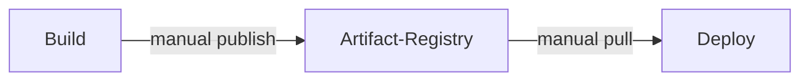
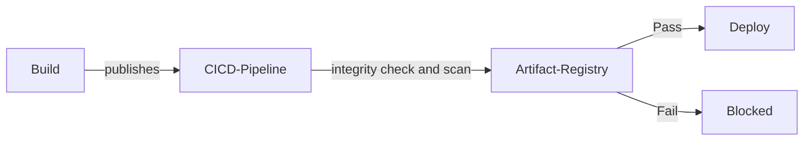
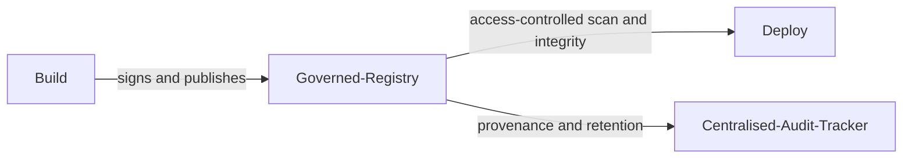

# Secure Artifact Management

| ID            |
| ------------- |
| DSOVS-REL-002 |

## Summary

Secure Artifact Management is the practice of securing the artifacts produced throughout the software development lifecycle, such as build outputs, container images, packages, and binaries, from the moment they are created until they are deployed or retired.

It is important for organisations to have secure artifact management in place to ensure that the software being released is trustworthy, reliable, and up to date with current security standards. By storing artifacts in access-controlled, integrity-verified registries, teams can detect, control, and protect their software from tampering and unauthorised modification.

A mature approach links every released artifact back to the build that produced it, preserving provenance and a verifiable chain of custody. This prevents unauthorised changes that could introduce vulnerabilities, supports incident investigation and rollback, and helps organisations remain compliant with industry regulations and standards.

## Level 0 - No package management tool used for releases

At this level there is no dedicated repository or registry for release artifacts. Builds are distributed in an ad hoc manner, perhaps as files copied to shared drives, attached to tickets, or rebuilt directly on target hosts. Because artifacts are not stored in a controlled location, there is no reliable way to know which build is running in any given environment, who produced it, or whether it has been altered after the fact.

The absence of a managed store means there are no access controls, no integrity guarantees, and no audit trail. Organisations operating here face a high risk of deploying tampered or outdated artifacts and have little ability to reproduce or investigate a release once it has shipped.

## Level 1 - Verify implementation of a centralised single storage location for release artifacts

At this stage the organisation has adopted a central repository or registry where release artifacts are published and retrieved, rather than scattering them across machines and shared folders. Developers push builds to a known location, and downstream consumers pull from that same place, giving teams a single authoritative source for each artifact.

While this consolidation brings basic order and accountability, the process is still largely manual and trust is implicit. Artifacts are stored, but their integrity is not yet systematically verified before use, and retention is managed on an as-needed basis. The registry provides a foundation, but its protections depend on individuals following the agreed conventions.



## Level 2 - Verify implementation of artifact integrity check before release to any environment

At this level integrity verification is automated and built directly into the delivery pipeline. As artifacts are published and consumed, their checksums or digests are recorded and validated, so that any artifact promoted to a test, staging, or production environment is confirmed to be exactly the one produced by the trusted build, with no tampering in transit or at rest.

These checks are enforced rather than optional, typically combined with vulnerability scanning of images and packages as they enter the registry. By failing the pipeline when an integrity check or scan does not pass, the organisation ensures that only verified, known-good artifacts move forward, closing the gap between building software and releasing it.



## Level 3 - Verify implementation to archiving process for artifacts

At the highest level of maturity the registry is centrally governed, access-controlled, and fully audited, and a defined archiving and retention process governs the entire lifecycle of every artifact. Released builds and their associated metadata, including provenance, signatures, and scan results, are retained according to policy so that any previously shipped version can be retrieved, verified, and redeployed when required.

Permissions are managed centrally with least-privilege access, and all push, pull, promotion, and deletion activity is logged for audit. Retention and immutability rules are continuously reviewed against compliance and operational needs, ensuring that the artifact store remains a trustworthy, traceable system of record that supports rollback, forensic investigation, and long-term reproducibility.



# Notable Tools

⚠️ **Disclaimer**

Apart from official OWASP Projects, the tools in this section have been chosen on the basis of their proven capabilities alone and there is no other relationship between the DSOVS project leaders and the creators or vendors who maintain them. 

If you have a suggestion for a notable tool please [💡 Suggest a Tool](https://github.com/OWASP/www-project-devsecops-verification-standard/discussions/categories/ideas) 

## [Harbor](https://github.com/goharbor/harbor)

Harbor is an open source, CNCF-graduated registry that stores, signs, and scans container images and other OCI artifacts. It adds the policy and governance controls expected at higher maturity levels, including role-based access control, project-level permissions, vulnerability scanning via Trivy, image signing, replication, and configurable retention and immutability rules.

Harbor can block the pull or deployment of images that fail a vulnerability threshold, enforcing the integrity and quality gates described in Levels 2 and 3.

<a href="https://github.com/aquasecurity/trivy-action"> GitHub Actions

```yaml
jobs:
  build-push-scan:
    runs-on: ubuntu-latest
    steps:
      - uses: actions/checkout@v4

      - name: Log in to Harbor
        uses: docker/login-action@v3
        with:
          registry: harbor.example.com
          username: ${{ secrets.HARBOR_USERNAME }}
          password: ${{ secrets.HARBOR_PASSWORD }}

      - name: Build and push image
        uses: docker/build-push-action@v5
        with:
          push: true
          tags: harbor.example.com/team/app:${{ github.sha }}

      # Harbor scans on push; this gate fails the build on HIGH/CRITICAL findings
      - name: Verify image scan results
        uses: aquasecurity/trivy-action@master
        with:
          image-ref: harbor.example.com/team/app:${{ github.sha }}
          severity: HIGH,CRITICAL
          exit-code: "1"
```

## [Sonatype Nexus Repository](https://github.com/sonatype/nexus-public) / [JFrog Artifactory](https://jfrog.com/artifactory/)

Sonatype Nexus Repository and JFrog Artifactory are widely used universal artifact repositories that manage release binaries, packages, and container images across many formats (Maven, npm, PyPI, Docker, and more). Both provide centralised storage, fine-grained access control, retention and cleanup policies, and integrity verification through recorded checksums, as well as integration with vulnerability scanning to gate insecure components before they are consumed.

<a href="https://aquasecurity.github.io/trivy/v0.18.3/integrations/gitlab-ci/"> GitLab CI

```yaml
publish_artifact:
  stage: publish
  script:
    # Generate and record a checksum for integrity verification
    - sha256sum build/app.jar > build/app.jar.sha256
    # Publish the artifact and its checksum to Nexus
    - |
      curl --fail --user "$NEXUS_USER:$NEXUS_PASSWORD" \
        --upload-file build/app.jar \
        "https://nexus.example.com/repository/releases/com/example/app/$CI_COMMIT_TAG/app.jar"
    - |
      curl --fail --user "$NEXUS_USER:$NEXUS_PASSWORD" \
        --upload-file build/app.jar.sha256 \
        "https://nexus.example.com/repository/releases/com/example/app/$CI_COMMIT_TAG/app.jar.sha256"
  rules:
    - if: $CI_COMMIT_TAG
```

## References

- Harbor documentation: https://goharbor.io/docs/
- Sonatype Nexus Repository: https://help.sonatype.com/repomanager3
- JFrog Artifactory: https://jfrog.com/help/r/jfrog-artifactory-documentation
