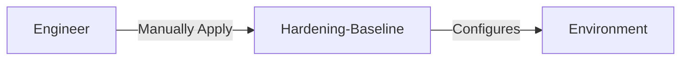
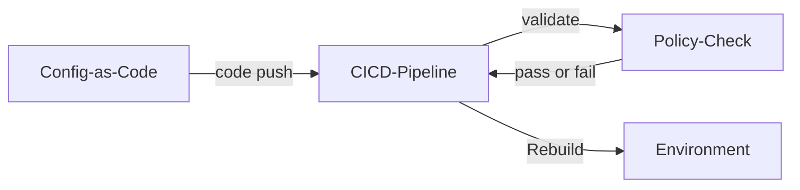
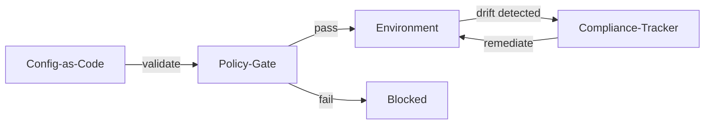

# Secure Configuration

| ID            |
| ------------- |
| DSOVS-REL-004 |

## Summary

Secure configuration is a set of best practices for configuring systems and applications in order to maintain security and data integrity. 

It is important in DevSecOps as it helps ensure that all environments, including development, test, and production, are configured in a secure manner. 

This is especially important in a DevSecOps environment, since changes are quickly implemented and deployed, making it more likely that mistakes in configuration can result in security breaches. 

Secure configuration can help reduce the risk of such errors, by providing a standard approach to configuring devices and applications.

## Level 0 - No security hardening standards, secure configuration standards or baseline

At this level the organisation has no defined hardening standards or secure configuration baselines for its environments and services. Systems are deployed using vendor or framework defaults, which frequently leave insecure features enabled, debug interfaces exposed, default credentials in place and permissions far broader than necessary.

Because there is no agreed reference for what "secure" looks like, configuration decisions are left to individual engineers and vary widely between systems. The result is an inconsistent estate where weaknesses are introduced silently and there is no reliable way to know whether a given environment is safe to run in production.

## Level 1 - Verify that the hardening standards for environment and secure configuration baseline exist and up to date

At this level the organisation has documented hardening standards and a secure configuration baseline, typically derived from recognised guidance such as the CIS Benchmarks or vendor security guides. These baselines describe how operating systems, services, containers and cloud resources should be configured, covering areas such as disabling insecure defaults, removing unused services and applying least privilege.

The baseline is applied manually, with engineers expected to follow the documented standard when they build or change an environment. While this establishes a clear and maintained reference point, enforcement still relies on individual discipline and periodic review, so configuration drift and human error remain likely between checks.



## Level 2 - Verify that the periodic review schedule for secure configuration baseline is in place and rebuild environment every application release using the latest configuration

At this level the secure configuration baseline is validated automatically rather than by hand. Infrastructure and configuration are defined as code, and the pipeline runs policy and configuration checks against that code on every change, flagging insecure settings such as public storage, permissive network rules or missing encryption before they reach an environment.

A periodic review schedule keeps the baseline current as new threats and platform features emerge, and environments are rebuilt from the latest approved configuration on each application release rather than being patched in place. This combination of automated validation and routine rebuilds sharply reduces drift and ensures that what is deployed reflects the intended secure state.



## Level 3 - Verify implementation to detect outdated configuration and prevent any configuration drift

At this level secure configuration is enforced as a gate. Configuration policy is centrally defined and version controlled, and changes that violate the baseline are blocked in the pipeline or at deployment time rather than merely reported. Compliance results are tracked centrally so that the security posture of every environment is visible and measurable over time.

Continuous monitoring detects outdated configuration and any drift in running environments, automatically remediating or rolling back deviations from the approved baseline. Trends and exceptions feed a continuous improvement loop in which the baseline, the detection rules and the enforcement policies are regularly refined, keeping the whole estate aligned with the organisation's security standards.



# Notable Tools

⚠️ **Disclaimer**

Apart from official OWASP Projects, the tools in this section have been chosen on the basis of their proven capabilities alone and there is no other relationship between the DSOVS project leaders and the creators or vendors who maintain them. 

If you have a suggestion for a notable tool please [💡 Suggest a Tool](https://github.com/OWASP/www-project-devsecops-verification-standard/discussions/categories/ideas) 

## [Open Policy Agent (OPA)](https://github.com/open-policy-agent/opa)

Open Policy Agent (OPA) is a general-purpose policy engine that lets you express secure configuration rules as code in the Rego language. OPA can evaluate Terraform plans, Kubernetes manifests, cloud configuration and other structured inputs against your baseline, making it a flexible foundation for validating configuration consistently across environments.

The Rego policy below denies any storage configuration that is publicly accessible or that has encryption disabled:

```rego
package config.storage

# Deny buckets that are publicly accessible
deny[msg] {
    input.resource.type == "storage_bucket"
    input.resource.public_access == true
    msg := sprintf("Storage bucket '%s' must not allow public access", [input.resource.name])
}

# Deny buckets without encryption at rest
deny[msg] {
    input.resource.type == "storage_bucket"
    not input.resource.encryption.enabled
    msg := sprintf("Storage bucket '%s' must have encryption at rest enabled", [input.resource.name])
}
```

Evaluate the policy in CI and fail the build when any `deny` rule matches:

```sh
opa eval --fail-defined \
  --data policy/ \
  --input plan.json \
  'data.config.storage.deny'
```

## [Checkov](https://github.com/bridgecrewio/checkov)

Checkov is an open source static analysis tool for infrastructure as code. It ships with hundreds of built-in policies for Terraform, CloudFormation, Kubernetes, Helm, ARM and serverless definitions, detecting insecure defaults such as unencrypted volumes, open security groups and over-privileged IAM before resources are provisioned.

The GitHub Actions snippet below runs Checkov against the repository on every push and fails the build when a misconfiguration is found:

```yaml
name: Secure Configuration Scan

on: [push, pull_request]

jobs:
  checkov:
    runs-on: ubuntu-latest
    steps:
      - name: Checkout
        uses: actions/checkout@v4

      - name: Run Checkov
        uses: bridgecrewio/checkov-action@master
        with:
          directory: .
          framework: terraform
          soft_fail: false
          output_format: sarif
          output_file_path: results.sarif

      - name: Upload results to GitHub Security
        uses: github/codeql-action/upload-sarif@v3
        with:
          sarif_file: results.sarif
```

## References

- CIS Benchmarks: https://www.cisecurity.org/cis-benchmarks
- Open Policy Agent documentation: https://www.openpolicyagent.org/docs/latest/
- Checkov documentation: https://www.checkov.io/