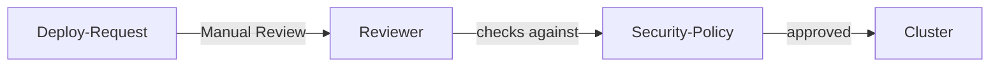
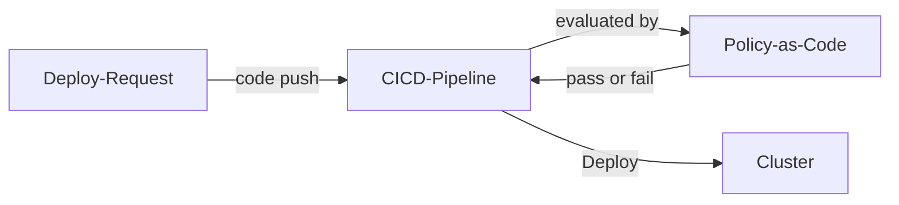
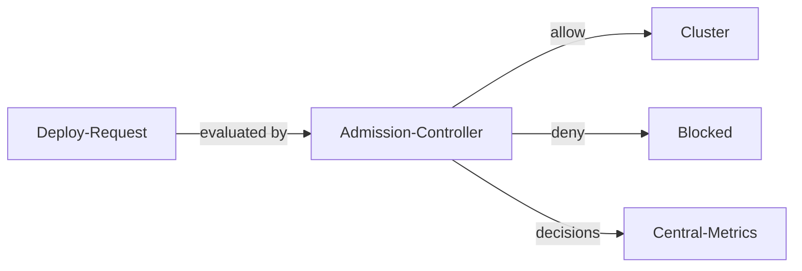

# Security Policy Enforcement

| ID            |
| ------------- |
| DSOVS-REL-005 |

## Summary

Security Policy Enforcement (SPE) is a process that enables organizations to ensure that their security policies are adhered to. 

It involves monitoring activities, systems, and users within the organization to ensure that they comply with the organization's established security policies. 

SPE is an important part of DevSecOps because it helps organizations to detect and respond to security threats in a timely manner, protect sensitive data and resources, and ensure compliance with relevant laws and regulations. 

Additionally, by enforcing security policies, organizations can reduce their risk profile and guard against legal consequences.

## Level 0 - No security policy defined

At this level there are no security policies governing what may be deployed or how infrastructure changes are made. Teams are free to ship workloads and modify environments without any agreed constraints on, for example, privileged containers, exposed services or missing security controls.

With nothing defining acceptable practice, non-compliant changes pass through unchecked and are only discovered, if at all, after an incident. Security depends entirely on the awareness of individual engineers, leaving the organisation exposed to inconsistent and unsafe configurations.

## Level 1 - Verify the security policies defined for guardrails and security gates

At this level the organisation has defined and documented security policies that describe the guardrails and gates expected to protect its pipelines and environments. These policies set out requirements such as prohibiting privileged containers, mandating resource limits, requiring approved base images and blocking the deployment of known-vulnerable components.

The policies exist as written guidance and are applied manually, with engineers and reviewers expected to check changes against them before release. This provides a shared understanding of what is and is not allowed, but enforcement is dependent on human review, so policy violations can still slip through when checks are skipped or misunderstood.



## Level 2 - Verify implementation of guardrails and gates to enforce security policies

At this level the documented policies are expressed as code and validated automatically within the pipeline. Policy-as-code checks run against manifests, infrastructure definitions and build artifacts on every change, evaluating them against the agreed guardrails and reporting any violations back to the build.

Because the same rules are applied consistently to every change, enforcement no longer relies on individual reviewers remembering each requirement. Non-compliant changes are surfaced early and predictably, and the policy set becomes a living artifact that is versioned and tested alongside the systems it protects.



## Level 3 - Verify the chain of authorisation is implemented as part of the process of infrastructure changes deployment

At this level security policies are enforced as hard gates at admission and deploy time, so non-compliant changes are actively blocked rather than merely flagged. A clear chain of authorisation governs infrastructure changes, ensuring that deployments are admitted only when they satisfy policy and have passed the required approvals. Enforcement decisions are centrally tracked, giving full visibility of what was allowed, what was denied and why.

These centralised metrics drive continuous improvement: recurring violations, exceptions and emerging risks inform regular refinement of the policy set and the authorisation workflow. The result is a measured, self-correcting enforcement capability in which policies evolve with the environment and consistently prevent unsafe changes from reaching production.



# Notable Tools

⚠️ **Disclaimer**

Apart from official OWASP Projects, the tools in this section have been chosen on the basis of their proven capabilities alone and there is no other relationship between the DSOVS project leaders and the creators or vendors who maintain them. 

If you have a suggestion for a notable tool please [💡 Suggest a Tool](https://github.com/OWASP/www-project-devsecops-verification-standard/discussions/categories/ideas) 

## [OPA Gatekeeper](https://github.com/open-policy-agent/gatekeeper)

OPA Gatekeeper is a Kubernetes admission controller built on Open Policy Agent that enforces policy as code at admission time. Policies are defined as reusable ConstraintTemplates and instantiated as Constraints, allowing the cluster to reject non-compliant resources before they are ever created.

The example below defines a constraint template and a constraint that block any Pod requesting privileged containers:

```yaml
apiVersion: templates.gatekeeper.sh/v1
kind: ConstraintTemplate
metadata:
  name: k8sdenyprivileged
spec:
  crd:
    spec:
      names:
        kind: K8sDenyPrivileged
  targets:
    - target: admission.k8s.gatekeeper.sh
      rego: |
        package k8sdenyprivileged

        violation[{"msg": msg}] {
          c := input.review.object.spec.containers[_]
          c.securityContext.privileged == true
          msg := sprintf("Privileged container '%s' is not allowed", [c.name])
        }
---
apiVersion: constraints.gatekeeper.sh/v1beta1
kind: K8sDenyPrivileged
metadata:
  name: deny-privileged-containers
spec:
  match:
    kinds:
      - apiGroups: [""]
        kinds: ["Pod"]
```

## [Kyverno](https://github.com/kyverno/kyverno)

Kyverno is a policy engine designed specifically for Kubernetes, where policies are written as native Kubernetes resources rather than in a separate language. It can validate, mutate and generate configurations, and in `Enforce` mode it blocks any admission request that violates a policy.

The ClusterPolicy below denies workloads that run as root, enforcing the policy as a gate across the cluster:

```yaml
apiVersion: kyverno.io/v1
kind: ClusterPolicy
metadata:
  name: disallow-run-as-root
spec:
  validationFailureAction: Enforce
  background: true
  rules:
    - name: check-run-as-non-root
      match:
        any:
          - resources:
              kinds:
                - Pod
      validate:
        message: "Containers must not run as root; set runAsNonRoot to true."
        pattern:
          spec:
            =(securityContext):
              =(runAsNonRoot): true
            containers:
              - =(securityContext):
                  =(runAsNonRoot): true
```

## References

- Open Policy Agent Gatekeeper documentation: https://open-policy-agent.github.io/gatekeeper/
- Kyverno documentation: https://kyverno.io/docs/
- Policy as Code overview: https://www.openpolicyagent.org/docs/latest/