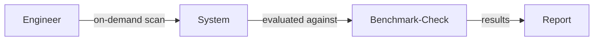
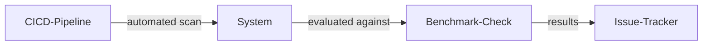
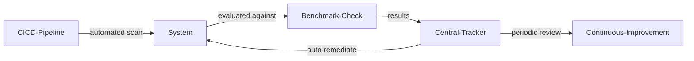

# Compliance Scanning

| ID            |
| ------------- |
| DSOVS-REL-007 |

## Summary

Compliance Scanning is a process of scanning system software and application to ensure that they are compliant with specific standards or regulations. It is an important part of DevSecOps as it enables the developers to quickly identify any potential compliance issues in their code and address them before they become a problem. 

Through compliance scanning, developers can also examine their code for potential security vulnerabilities that could be exploited by attackers. 

Compliance Scanning ultimately helps increase the overall security and reliability of applications and systems during development, testing and production stages.

## Level 0 - No tool to perform compliance check

At this level the organisation has no tooling or defined process for checking systems, hosts, or deployments against compliance benchmarks. Any assessment of whether infrastructure aligns with standards such as CIS Benchmarks, PCI DSS, or internal hardening baselines is carried out manually, if at all, and the results are neither consistent nor repeatable.

Without an automated compliance check, drift from a secure baseline goes unnoticed, misconfigurations accumulate over time, and the organisation cannot demonstrate to auditors or stakeholders that its environments meet the required controls.

## Level 1 - Verify use of tool to perform on-demand scan to perform security compliance check

At this stage a compliance scanning tool has been adopted and is run on demand against systems or deployments to evaluate them against a chosen benchmark. An engineer might, for example, execute Chef InSpec, OpenSCAP, or a cloud posture scanner such as Prowler against a host or account and review the resulting report.

Because the scans are triggered manually and on a case-by-case basis, coverage is uneven and results may not be retained or acted upon in a structured way. The capability nonetheless gives teams a concrete, tool-backed view of their compliance posture at a point in time.



## Level 2 - Verify that the compliance scanning tool is scheduled to perform automated scans and report status to system owner through a centralised issue tracking system

At this level compliance scanning is automated and integrated into the delivery pipeline or run on a regular schedule, so every relevant build or environment is assessed without human intervention. The scan executes as a pipeline stage or scheduled job and its pass or fail status is reported back automatically.

Findings are routed to the responsible system owner through a centralised issue tracking system, ensuring that compliance gaps are captured, assigned, and tracked through to resolution rather than being lost in ad-hoc reports. This gives the organisation continuous, consistent visibility of its compliance state across all in-scope systems.



## Level 3 - Verify that the mechanism to apply automatic remediation automatically exists at the time of vulnerability identified

At the highest level the organisation not only detects compliance violations automatically but also remediates them. When a scan identifies a deviation from the benchmark, an automated remediation mechanism, such as a configuration-management playbook, policy-as-code controller, or remediation pipeline, brings the affected system back into a compliant state without manual effort.

Compliance results and remediation actions are centrally tracked and measured, and the effectiveness of the benchmarks, scanning rules, and remediation logic is reviewed periodically and continuously improved. This closes the loop between detection and correction, keeping environments aligned with the required standards over time.



# Notable Tools 

⚠️ **Disclaimer**

Apart from official OWASP Projects, the tools in this section have been chosen on the basis of their proven capabilities alone and there is no other relationship between the DSOVS project leaders and the creators or vendors who maintain them. 

If you have a suggestion for a notable tool please [💡 Suggest a Tool](https://github.com/OWASP/www-project-devsecops-verification-standard/discussions/categories/ideas) 

## [Chef InSpec](https://github.com/inspec/inspec)

Chef InSpec is an open source framework for describing compliance and security requirements as human-readable code. Controls can be run against servers, containers, and cloud resources to test them against benchmarks such as the CIS Benchmarks, and the same profiles can be executed locally or from a pipeline.

<a href="https://github.com/inspec/inspec"> GitHub Actions

```
name: compliance-scan
on:
  push:
  workflow_dispatch:
jobs:
  inspec:
    runs-on: ubuntu-latest
    steps:
      - uses: actions/checkout@v4
      - name: Install InSpec
        run: curl https://omnitruck.chef.io/install.sh | sudo bash -s -- -P inspec
      - name: Run CIS compliance profile
        run: |
          inspec exec https://github.com/dev-sec/linux-baseline \
            --chef-license accept-silent \
            --reporter cli json:inspec-report.json
      - name: Upload report
        if: always()
        uses: actions/upload-artifact@v4
        with:
          name: inspec-report
          path: inspec-report.json
```

## [OpenSCAP](https://github.com/OpenSCAP/openscap)

OpenSCAP is an open source implementation of the Security Content Automation Protocol (SCAP). Using the `oscap` command line tool together with SCAP Security Guide content, it evaluates a host against standardised profiles (for example a PCI DSS or CIS profile) and can generate both machine-readable results and an HTML report.

```
# Evaluate the host against the PCI-DSS profile from the SCAP Security Guide
oscap xccdf eval \
  --profile xccdf_org.ssgproject.content_profile_pci-dss \
  --results scan-results.xml \
  --report scan-report.html \
  /usr/share/xml/scap/ssg/content/ssg-rhel9-ds.xml
```

## [Prowler](https://github.com/prowler-cloud/prowler)

Prowler is an open source security and compliance tool for cloud environments such as AWS, Azure, Google Cloud, and Kubernetes. It ships with checks mapped to frameworks including CIS, PCI DSS, and others, making it well suited to automated cloud compliance scanning in a pipeline.

```
# Scan an AWS account against the CIS benchmark and emit JSON + HTML output
prowler aws \
  --compliance cis_2.0_aws \
  --output-formats json-ocsf html \
  --output-directory ./prowler-output
```