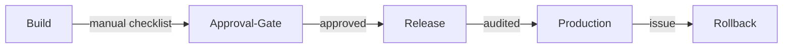
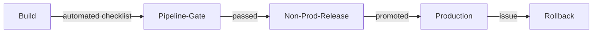
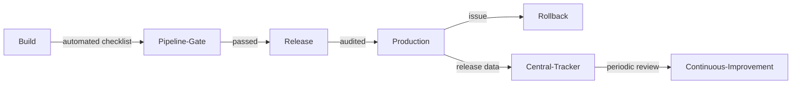

# Secure Release Management

| ID            |
| ------------- |
| DSOVS-REL-008 |

## Summary

Secure Release Management is the process of controlling and managing system and application releases in a secure manner. This includes ensuring that the release meets organization security standards and is free of any vulnerabilities. 

It also ensures that the released code is properly tested, validated, and approved before deployment. 

Secure Release Management enables organizations to maintain high levels of trust in their systems and applications as it helps ensure that all software changes are properly implemented and tracked.

## Level 0 - No security checklist used in release management

At this level releases are pushed to production in an ad-hoc fashion with no security checklist, approval gate, or change-management process governing them. Whether a release has been reviewed, tested, or authorised depends entirely on the individual performing it, and there is no consistent record of what was deployed, by whom, or why.

The absence of a controlled, auditable release process means insecure or unapproved changes can reach production unchallenged, and the organisation has little ability to trace, verify, or roll back a problematic release once it is live.

## Level 1 - Verify that the security checklist in enforced in all release management with exception process in place

At this stage a defined security checklist is applied to every release, covering the key controls that must be satisfied before a change is approved for deployment, such as completion of required testing, vulnerability review, and sign-off by an accountable owner. A documented exception process exists so that any deviation from the checklist is consciously requested, justified, and recorded rather than silently bypassed.

This introduces a basic but consistent approval gate and audit trail across releases. Adherence is largely enforced through process and manual verification, but it establishes the discipline of controlled, authorised change as a precondition for release.

## Level 2 - Verify implementation of security checklist in non-production stage releases

At this level the security checklist is built into the delivery pipeline and enforced automatically against non-production stage releases, so that changes are validated in test, staging, or pre-production environments before they can progress towards production. Checklist items are implemented as automated gates within the pipeline, and a release that fails to satisfy them is blocked from promotion.

By integrating the controls into the pipeline and exercising them in non-production stages first, the organisation catches policy and security failures early, maintains a verifiable record of each promotion decision, and aligns its release flow with supply-chain integrity expectations such as those described by the SLSA framework.

## Level 3 - Verify that periodic review schedule is defined to review the security checklist

At the highest level the release-management controls are not only automated and centrally tracked but also continuously improved. A defined, periodic review schedule governs the security checklist itself, ensuring that its items remain relevant as threats, regulations, and the organisation's architecture evolve, and that approval gates and rollback procedures are kept effective.

Release and approval data is centrally tracked and measured, and insights from incidents, exceptions, and audit findings feed back into the checklist and change-management process. This creates a closed loop in which the secure release process is regularly assessed against authoritative guidance such as SLSA, OWASP SAMM, and the NIST Secure Software Development Framework, and refined over time.

# Notable Tools 

⚠️ **Disclaimer**

Apart from official OWASP Projects, the tools in this section have been chosen on the basis of their proven capabilities alone and there is no other relationship between the DSOVS project leaders and the creators or vendors who maintain them. 

If you have a suggestion for a notable tool please [💡 Suggest a Tool](https://github.com/OWASP/www-project-devsecops-verification-standard/discussions/categories/ideas) 

## [Argo Rollouts](https://github.com/argoproj/argo-rollouts)

Argo Rollouts is a Kubernetes controller that provides progressive-delivery release strategies such as blue-green and canary deployments, with automated analysis and the ability to halt and roll back a release automatically when health or analysis metrics fail. This supports controlled, auditable, and reversible releases as part of a secure release-management process.

## Further reading

- SLSA (Supply-chain Levels for Software Artifacts): https://slsa.dev
- OWASP SAMM — Operations domain: https://owaspsamm.org/model/operations/
- NIST Secure Software Development Framework (SSDF), SP 800-218: https://csrc.nist.gov/projects/ssdf