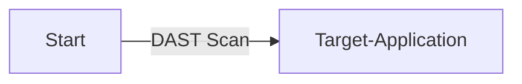
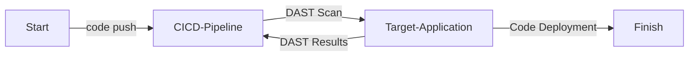
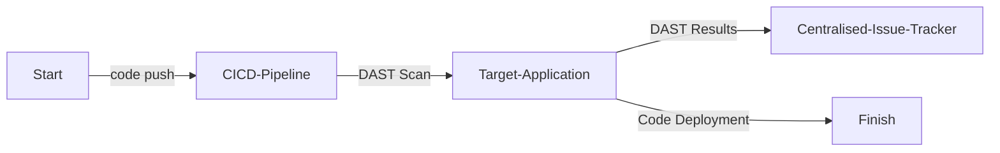

# Dynamic Application Security Testing (DAST)

| ID             |
| -------------- |
| DSOVS-TEST-002 |

## Summary

Dynamic Application Security Testing (DAST) involves analyzing an application's security while it is running in order to detect any vulnerabilities. 

It focuses on assessing an application and examining the behavior of the application to identify potential issues without requiring a deep understanding of the source code. 

This type of testing is operational and behavioral, as testers look for problems that occur in use and trace them back to their origins in the software design. DAST is useful for basic security on evolving projects and for meeting industry-standard compliance.

## Level 0 - No tool to perform dynamic application security testing

At this level of security maturity, there are no tools available to perform Dynamic Application Security (DAST) scanning. 

## Level 1 - Verify use of tool to perform on-demand scan to identify application vulnerabilities in its running state

At this stage, a DAST tool is present but the scanning is performed on a case-by-case basis. It is not automated and the results may not be reported or recorded. 



## Level 2 - Verify the implementation of the dynamic application security testing tool into the build pipeline to perform automated scans and report status to the build

Here, DAST scanning is implemented into the software build pipeline. This means that whenever a build is executed, an automated DAST scan will be triggered and the results will be reported. 



## Level 3 - Verify that the findings are automatically recorded to a centralised issue tracker system and periodically review tool's effectiveness

Level 3 of Dynamic Application Security (DAST) is the same as level 2, with the addition of all identified security vulnerabilities being recorded in a centralised issue tracking system and periodically reviewed to evaluate the effectiveness of the DAST tool. This means that the same type of automated scans are being performed, but the results are being collected, tracked and analysed for future use and improvement.



# Notable Tools 

⚠️ **Disclaimer**

Apart from official OWASP Projects, the tools in this section have been chosen on the basis of their proven capabilities alone and there is no other relationship between the DSOVS project leaders and the creators or vendors who maintain them. 

If you have a suggestion for a notable tool please [💡 Suggest a Tool](https://github.com/OWASP/www-project-devsecops-verification-standard/discussions/categories/ideas) 

## [OWASP ZAP](https://github.com/zaproxy/zaproxy)

The OWASP Zed Attack Proxy (ZAP) is one of the world’s most popular free security tools and is actively maintained by a dedicated international team of volunteers. It can help you automatically find security vulnerabilities in your web applications while you are developing and testing your applications. It's also a great tool for experienced pentesters to use for manual security testing.

<a href="https://github.com/zaproxy/zaproxy"> GitHub Actions

```
on: [push]

jobs:
  zap_scan:
    runs-on: ubuntu-latest
    name: Scan the webapplication
    steps:
      - name: Checkout
        uses: actions/checkout@v2
        with:
          ref: master
      - name: ZAP Scan
        uses: zaproxy/action-baseline@v0.7.0
        with:
          token: ${{ secrets.GITHUB_TOKEN }}
          docker_name: 'owasp/zap2docker-stable'
          target: 'https://www.zaproxy.org'
          rules_file_name: '.zap/rules.tsv'
          cmd_options: '-a'
```

<a href="https://gitlab.com/gitlab-org/security-products/dependencies/zaproxy"> GitLab CI


```
dast:
  image: registry.gitlab.com/gitlab-org/security-products/zaproxy
  variables:
    website: "https://example.com"
  script:
    - mkdir /zap/wrk/
    - /zap/zap-baseline.py -J gl-dast-report.json -t $website || true
    - cp /zap/wrk/gl-dast-report.json .
  artifacts:
    paths: [gl-dast-report.json]

```

<a href="https://medium.com/adessoturkey/owasp-zap-security-tests-in-azure-devops-fe891f5402a4"> Azure DevOps

```
resources:
  repositories:
    - repository: <repo_name>
      type: git
      name: <project_name>/<repo_name>
      ref: refs/heads/master

trigger: none

stages:
- stage: 'buildstage'
  jobs:
  - job: 'buildjob'
    pool: 
      vmImage: 'ubuntu-latest'
    steps:
    - checkout: self
    - checkout: <repo_name>

    - bash: docker run -d -p <container_port>:<target_port> <your_image>
      displayName: 'App Container'

    - bash: |
        chmod -R 777  ./
        docker run --rm -v $(pwd):/zap/wrk/:rw -t owasp/zap2docker-stable zap-full-scan.py -t http://$(ip -f inet -o addr show docker0 | awk '{print $4}' | cut -d '/' -f 1):<container_port> -x 
xml_report.xml
        true
      displayName: 'Owasp Container Scan'

    - powershell: |
        $XslPath = "<repo_name>/xml_to_nunit.xslt" 
        $XmlInputPath = "xml_report.xml"
        $XmlOutputPath = "converted_report.xml"
        $XslTransform = New-Object System.Xml.Xsl.XslCompiledTransform
        $XslTransform.Load($XslPath)
        $XslTransform.Transform($XmlInputPath, $XmlOutputPath)
      displayName: 'PowerShell Script'
    - task: PublishTestResults@2
      displayName: 'Publish Test Results'
      inputs:
        testResultsFormat: 'NUnit'
        testResultsFiles: 'converted_report.xml'
```

## [Nuclei](https://github.com/projectdiscovery/nuclei)

Nuclei is used to send requests across targets based on a template, leading to zero false positives and providing fast scanning on a large number of hosts. Nuclei offers scanning for a variety of protocols, including TCP, DNS, HTTP, SSL, File, Whois, Websocket, Headless etc. With powerful and flexible templating, Nuclei can be used to model all kinds of security checks.

<a href="https://github.com/projectdiscovery/nuclei-action"> GitHub Actions</a>

```
name: Nuclei - Vulnerability Scan

on:
    schedule:
      - cron: '0 0 * * *'
    workflow_dispatch:

jobs:
  nuclei-scan:
    runs-on: ubuntu-latest
    steps:
      - uses: actions/checkout@v2

      - name: Nuclei - Vulnerability Scan
        uses: projectdiscovery/nuclei-action@main
        with:
          target: https://example.com

      - name: GitHub Workflow artifacts
        uses: actions/upload-artifact@v2
        with:
          name: nuclei.log
          path: nuclei.log

      - name: GitHub Security Dashboard Alerts update
        uses: github/codeql-action/upload-sarif@v2
        with:
          sarif_file: nuclei.sarif
```

## 🙏 Credits

We could not do this without the amazing contributions made to the community so we'd like to take the time to show our appreciation to any external inspiration used. 

* [Manas Peçenek](https://www.linkedin.com/in/manas-pecenek-1812pr/)
