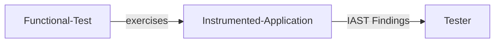
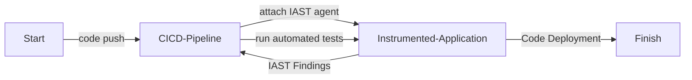
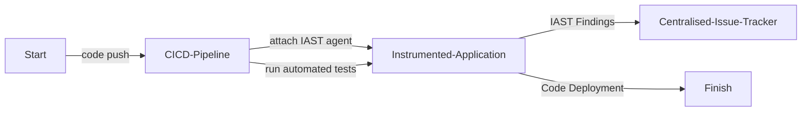

# Interactive Application Security Testing (IAST)

| ID             |
| -------------- |
| DSOVS-TEST-003 |

## Summary

Interactive Application Security Testing (IAST) works from inside a running application. An instrumentation agent is attached to the application at runtime and observes code as it actually executes while the software is exercised by functional or automated tests. Because the agent can see the source code, data flow, configuration, libraries and HTTP traffic all at once, it can confirm whether a suspected weakness is genuinely reachable and exploitable.

This inside-out perspective lets IAST combine the strengths of SAST and DAST. Like SAST it can pinpoint the exact line of vulnerable code, and like DAST it only reports issues that occur during real execution. The result is high-accuracy findings with very low false-positive rates, produced as a natural by-product of the testing teams are already running.

By surfacing vulnerabilities earlier and tying them directly to the code that caused them, IAST helps developers and security teams triage and resolve issues quickly, across the entire application stack and for both known and previously unseen weaknesses.

## Level 0 - No tool to perform interactive application security testing

At this level there is no IAST capability in place. No runtime instrumentation or agent is attached to the application, so no security analysis is gathered while the software runs. Any vulnerabilities that depend on real execution behaviour go undetected by this class of tooling, and the organisation relies solely on other techniques such as static or dynamic analysis.

## Level 1 - Verify use of tool to perform on-demand scan to identify insecure code when the running application is being functionally tested

At this stage an IAST agent is available and used, but only on a case-by-case basis. A team will manually attach the agent to a running instance of the application and then exercise it through functional testing to observe what the instrumentation reports. This already improves on Level 0, because issues are now confirmed against live execution rather than missed entirely.

However, the activity is ad-hoc and depends on someone remembering to run it. The agent is not part of any automated test run, and the findings are typically not recorded or reported in a consistent way, so coverage and follow-up vary from one effort to the next.



## Level 2 - Verify the implementation of the interactive application security testing tool into the build pipeline to perform automated scans and report status to the build

Here the IAST agent is integrated into the build pipeline and attached automatically whenever the application is launched for its automated test suite. As integration, end-to-end and QA tests drive the running application, the agent continuously observes execution and detects vulnerabilities in the background, then reports the outcome back to the build.

This removes the manual, on-demand nature of Level 1. Every pipeline run that exercises the application produces consistent IAST coverage and feeds the result into the build status, so security analysis happens repeatably without anyone having to remember to trigger it.



## Level 3 - Verify that the findings are automatically recorded to a centralised issue tracker system and periodically review tool's effectiveness

Level 3 builds on the automated integration of Level 2 by ensuring that every finding flows automatically into a centralised issue tracking system, alongside vulnerabilities discovered by other means. Issues are managed, prioritised and remediated through the same workflow the organisation uses for the rest of its security work, so nothing slips through the gaps.

In addition, the effectiveness of the IAST tooling is reviewed periodically. Teams examine which weaknesses the agent is catching, tune its configuration and coverage, and feed lessons back into the process so the capability keeps improving over time rather than standing still.



# Notable Tools

⚠️ **Disclaimer**

Apart from official OWASP Projects, the tools in this section have been chosen on the basis of their proven capabilities alone and there is no other relationship between the DSOVS project leaders and the creators or vendors who maintain them. 

If you have a suggestion for a notable tool please [💡 Suggest a Tool](https://github.com/OWASP/www-project-devsecops-verification-standard/discussions/categories/ideas) 

Most of the mature IAST tooling on the market is commercial, including Contrast Assess and Synopsys Seeker. A freely available option is **Contrast Community Edition**, which offers IAST instrumentation for a single application and is a practical way to evaluate the technique. For broader context on application security testing approaches, the [OWASP Foundation](https://owasp.org/) is a useful starting point.

## [Contrast Community Edition](https://www.contrastsecurity.com/contrast-community-edition)

Contrast Community Edition (CE) provides runtime IAST (and runtime protection) for a single application, free of charge. The agent is attached to the application process rather than invoked as a separate scan step, so it observes vulnerabilities while your existing functional and automated tests exercise the app.

For a JVM application, the agent is typically attached by adding it to the start-up command, for example:

```
java -javaagent:/opt/contrast/contrast-agent.jar \
     -Dcontrast.config.path=/etc/contrast/contrast_security.yaml \
     -jar my-application.jar
```

With the agent attached, the application is then driven by its normal test suite in the pipeline. Findings are surfaced as the instrumented code executes; no separate scanning stage against the target is required because the analysis happens from inside the running process.
