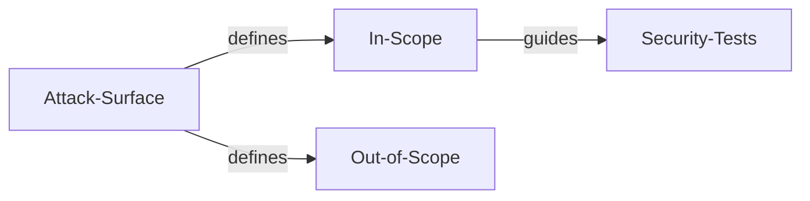
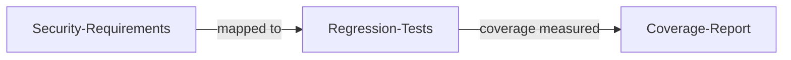
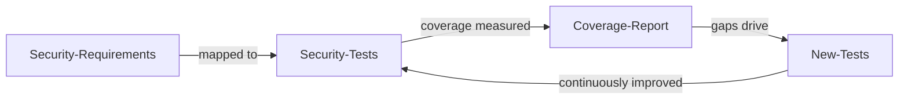

# Security Test Coverage

| ID             |
| -------------- |
| DSOVS-TEST-005 |

## Summary

Security test coverage is concerned with how comprehensively security testing actually exercises the application: its codebase, its attack surface and its security requirements. It is entirely possible to run security tests regularly yet still leave significant parts of the system unexamined, so this capability is about understanding, measuring and steadily increasing what the testing genuinely covers.

Coverage is best understood relative to a defined baseline of expectations. Mapping tests to a control framework such as the OWASP Application Security Verification Standard (ASVS) gives an objective yardstick: it makes clear which security requirements are tested, which are not, and where gaps exist between the agreed scope and the work actually performed.

As this capability matures, organisations move from having no defined testing scope, through clearly delineating what is in and out of scope, to measuring coverage against requirements and finally to tracking coverage over time and continuously closing gaps. The aim is to replace a vague sense that "security testing happens" with a measured, improving picture of how much of the application is genuinely assured.

## Level 0 - No security testing scope

At this level there is no defined scope for security testing, and consequently no notion of coverage at all. Testing, if it occurs, is opportunistic and undirected, and there is no statement of which components, interfaces or security requirements are meant to be examined.

Because nothing is defined, nothing can be measured. It is impossible to say whether the parts of the application most exposed to risk have been tested, and large portions of the attack surface may never be looked at. Any assurance the organisation has from security testing is incidental rather than the result of a deliberate, bounded effort.

## Level 1 - Verify that the security testing scope and out-of-scope are defined

At this level the organisation explicitly defines what security testing is intended to cover and, just as importantly, what it is not. The in-scope and out-of-scope components, interfaces, environments and requirements are written down, giving testers a clear remit and stakeholders a clear understanding of the boundaries of the assurance being provided.

This is the first step towards meaningful coverage. With scope defined, it becomes possible to reason about whether testing has addressed everything it was meant to, and to make deliberate, recorded decisions about exclusions rather than leaving gaps by accident. Coverage at this stage is still understood largely qualitatively and assessed by hand, but the boundaries that make measurement possible are now in place.

## Level 2 - Verify implementation of security regression testing

This level improves on the previous one by ensuring that security coverage is not lost over time. Security regression testing is implemented so that previously identified vulnerabilities, and the security requirements already verified, are re-tested as the application changes. Fixes are confirmed to stay fixed, and controls that once passed are checked again after each significant change.

By turning past findings and verified requirements into a repeatable test suite, coverage becomes cumulative rather than a snapshot. Mapping these regression tests to security requirements - for example to ASVS controls - makes the growing body of covered behaviour explicit and prevents previously assured areas from quietly regressing. Coverage is now measured against a baseline of requirements rather than merely scoped, giving a clearer view of what is consistently protected.

## Level 3 - Verify that security test coverage is continuously monitored and increased

At the highest level of maturity, security test coverage is continuously monitored and deliberately expanded over time. The proportion of the codebase, attack surface and security requirements exercised by testing is tracked as a metric, mapped against a framework such as ASVS, and reviewed so that gaps are visible and trends are understood.

Building on the regression testing of the previous level, the organisation treats coverage as something to be actively improved rather than merely maintained. Identified gaps drive new tests, coverage targets are set and monitored, and the effectiveness of the testing is periodically reassessed against evolving threats and requirements. This turns security testing into a measured, continuously improving capability in which the organisation can state with confidence how much of its application is assured and demonstrate that the figure is rising.

## Further reading
- [OWASP Application Security Verification Standard (ASVS)](https://owasp.org/www-project-application-security-verification-standard/) - a framework of security requirements that testing coverage can be mapped against and measured.
- [OWASP Web Security Testing Guide (WSTG)](https://owasp.org/www-project-web-security-testing-guide/) - a structured catalogue of tests that helps define and broaden the scope of security testing.
- [Code coverage vs. security coverage (OWASP Code Review Guide)](https://owasp.org/www-project-code-review-guide/) - discussion of why traditional code coverage metrics do not equate to security coverage.
- [NIST SP 800-218 Secure Software Development Framework (SSDF)](https://csrc.nist.gov/Projects/ssdf) - practices for defining, performing and continuously improving security testing across the development lifecycle.
